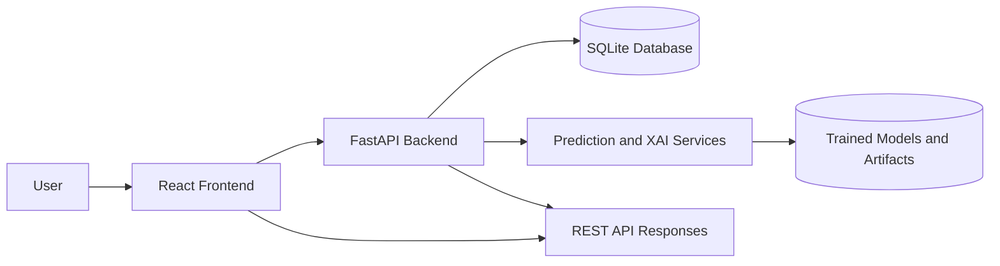
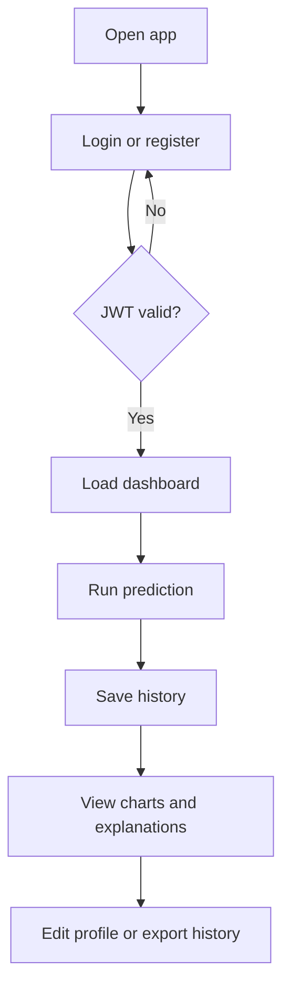
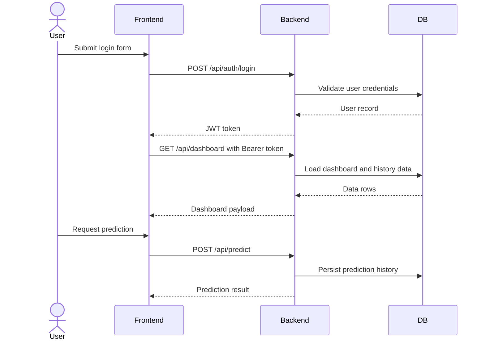
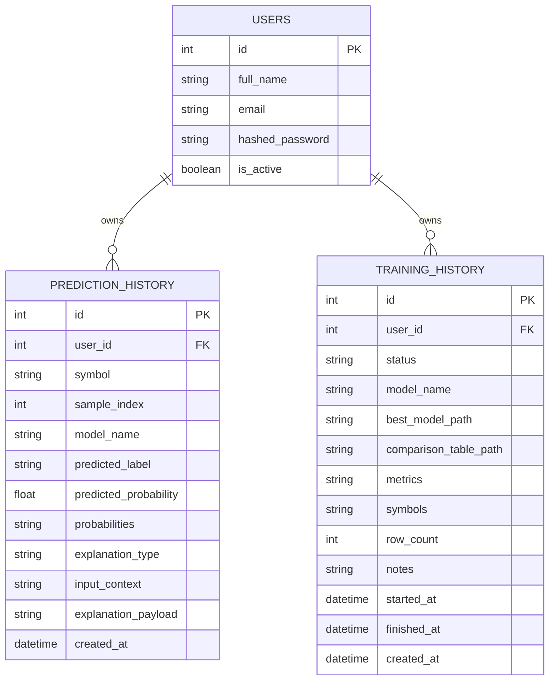
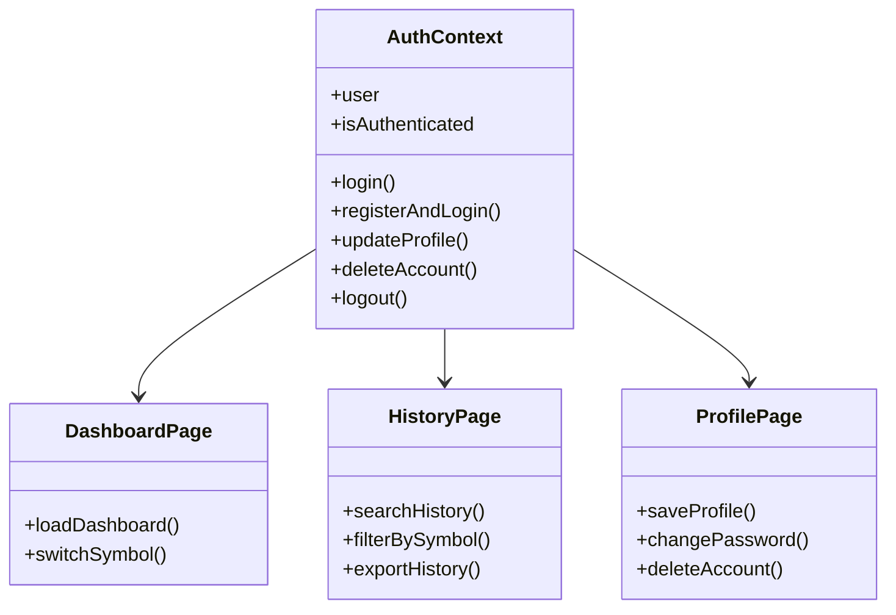
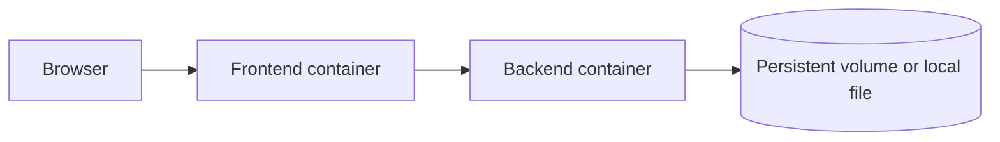

# System Design Documentation

## Overview

XAI-Stock is a two-tier web application with a React frontend and a FastAPI backend. The backend manages JWT authentication, prediction orchestration, history storage, and explainability artifacts. The frontend presents dashboard, prediction, history, profile, and visualization pages.

## Architecture diagram

## Flowchart

## Sequence diagram

## ER diagram

## UML diagram

## Deployment topology

## Key components

- React app handles navigation, responsive layout, and stateful forms.
- FastAPI exposes authenticated REST endpoints.
- SQLite stores users, prediction history, and training history.
- SHAP and LIME files are generated by the backend and served as artifacts.
